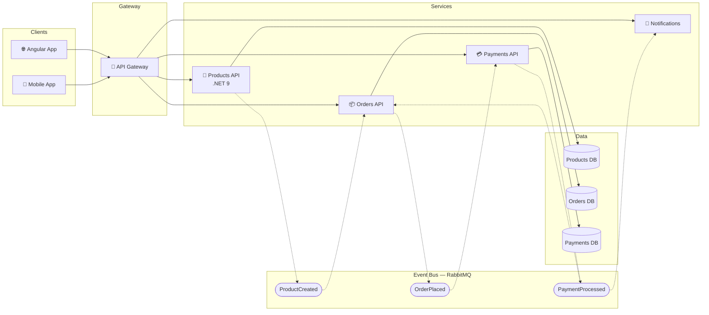

# Products API - Senior Developer Coding Test

A .NET 9 Web API with JWT authentication and an Angular 19 frontend for managing products.

## Prerequisites

- [.NET 9 SDK](https://dotnet.microsoft.com/download)
- [Node.js 18+](https://nodejs.org/)
- [Angular CLI](https://angular.io/cli) (`npm install -g @angular/cli`)

## Project Structure

```
MathewTest/
├── ProductsApi/              # .NET 9 Web API
│   ├── src/ProductsApi/      # API source code
│   └── tests/ProductsApi.Tests/  # Unit & integration tests
├── products-ui/              # Angular 19 frontend
└── README.md
```

## Running the API

```bash
cd ProductsApi/src/ProductsApi
dotnet run
```

The API runs on `http://localhost:5000` with Swagger UI at `http://localhost:5000/swagger`.

## Running the Frontend

```bash
cd products-ui
npm install
ng serve
```

The Angular app runs on `http://localhost:4200`.

## Running Tests

```bash
cd ProductsApi
dotnet test
```

**15 tests total**: 5 unit tests + 10 integration tests.

## API Endpoints

| Method | Endpoint | Auth | Description |
|--------|----------|------|-------------|
| GET | `/api/Health/Check` | No | Health check |
| POST | `/api/Auth/Token` | No | Get JWT token |
| GET | `/api/Products/GetAllProducts` | Yes | List all products |
| GET | `/api/Products/GetAllProducts?colour=Red` | Yes | Filter by colour |
| POST | `/api/Products/CreateProduct` | Yes | Create a product |

### Demo Credentials

- **Username**: `admin`
- **Password**: `admin`

## Technology Stack

### Backend
- .NET 9 with minimal hosting
- Entity Framework Core (In-Memory)
- JWT Bearer Authentication
- AutoMapper
- FluentValidation
- Swashbuckle (Swagger)
- xUnit + WebApplicationFactory

### Frontend
- Angular 19 (standalone components)
- Angular Material
- RxJS
- Functional HTTP interceptors

## Architecture Diagram

The diagram below shows how this Products API could fit into a distributed, event-driven microservices architecture.



### Architecture Decisions

- **API Gateway**: Single entry point for all clients. Handles cross-cutting concerns like rate limiting, routing, and load balancing.
- **Database per Service**: Each microservice owns its data store, ensuring loose coupling. Schema changes in one service don't break others.
- **Event-Driven Communication**: Services communicate asynchronously via a message bus (RabbitMQ/Kafka). For example, when a product is created, the Products API publishes a `ProductCreated` event that the Orders API consumes to keep its product catalogue in sync.
- **Event Flow**:
  - `ProductCreated` - Products API publishes when a product is added or updated
  - `OrderPlaced` - Orders API publishes when a customer places an order
  - `PaymentProcessed` - Payments API publishes after successful payment
  - `OrderConfirmed` - Triggers notification to the customer
- **Benefits**: Services can be deployed, scaled, and maintained independently. If the Payments API is temporarily unavailable, orders are still accepted and payment events are queued for processing.
